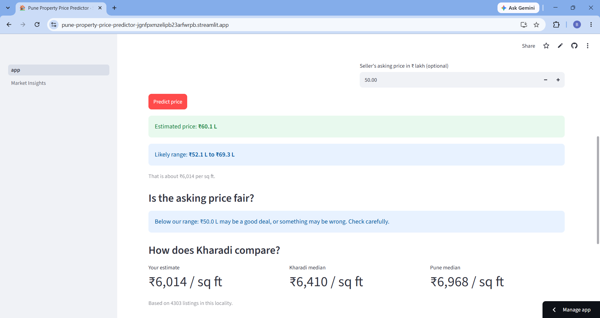
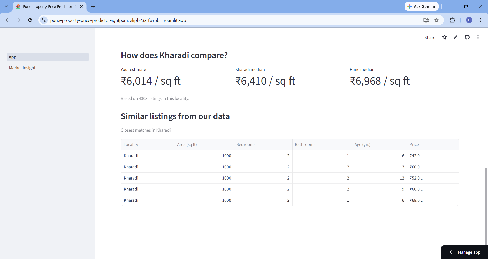
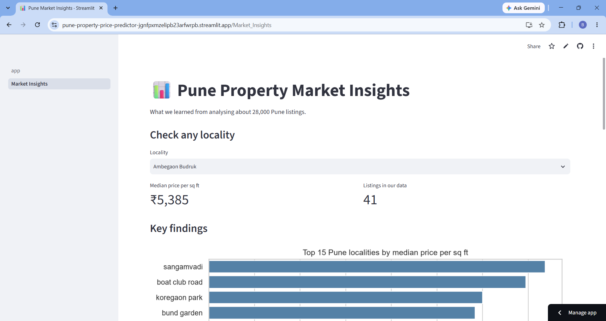

# 🏠 Pune Property Price Predictor

A machine learning web app that estimates the price of a property in Pune and helps buyers judge whether an asking price is fair.

**🔗 Live demo:** https://pune-property-price-predictor-jgnfpxmzelipb23arfwrpb.streamlit.app/
*(If the app is asleep, click "Yes, get this app back up!" and wait about a minute.)*

## Screenshots




## Features
- **Price estimate with a likely range** (for example ₹49 L to ₹76 L), not just one number
- **Fair price check:** enter the seller's asking price and see if it is underpriced, fair or overpriced
- **Locality comparison:** estimated price per sq ft vs the locality median and the Pune median
- **Similar listings** from the dataset
- **Market Insights page** with charts on what drives Pune property prices

## Results
Scores on a held-out test set (20% of the data the model never saw during training):

| Metric | Score |
|---|---|
| R² | 0.954 |
| Mean absolute error | ₹17.8 lakh |
| Median % error | 8.2% |
| Median % error in rare localities (<20 listings) | 13.2% |

**Model comparison** (initial run, before the locality feature below):

| Model | R² | Median % error |
|---|---|---|
| Random Forest | 0.948 | 8.4% |
| LightGBM | 0.947 | 9.4% |
| XGBoost | 0.946 | 9.6% |

The simplest model performed best, so I kept Random Forest.

### Testing found a problem, and I fixed it
When I tried the live app, a 1,000 sq ft flat in Deccan Gymkhana was estimated at about ₹62 L, although listings in that locality sell for ₹1.3 Cr or more. The model had lumped localities with few listings into one shared group, so it never learned that this area is expensive. The overall test score hid the problem because most listings are in big localities.

**Fix:** I added a feature for each locality's typical price per sq ft, calculated from training data only (so the test score stays honest), with small localities pulled toward the Pune average. The estimate rose to about ₹1.19 Cr, and the error on rare localities fell from 18.9% to 13.2%.

## What I did
1. **Data cleaning:** started with 37.5k raw listings and removed duplicate rows, bad rows, plots and unrealistic prices. Converted text such as "1,611 sq ft", "2 - 3 years" and long amenity lists into numeric columns. Final dataset: 28.4k listings.
2. **Avoiding data leakage:** left out price per sq ft as an input, because it is calculated from the price.
3. **EDA:** found that location and size matter most.
4. **Modeling:** predicted log(price) because prices are heavily skewed, filled missing values using training data only, and added a locality price feature after testing showed rare localities were underpriced.
5. **App:** built with Streamlit and deployed on Streamlit Community Cloud.

## Key insights
- Location matters most: Sangamvadi and Boat Club Road cost about double per sq ft compared with areas like Wanowrie.
- Each extra bedroom raises the price sharply; villas and penthouses are the most expensive.
- More amenities do **not** mean a higher price per sq ft, because amenity-rich projects tend to be in cheaper outer areas.

## Tech stack
Python, Pandas, NumPy, Scikit-learn, Matplotlib, Seaborn, Streamlit

## Project structure
```
app/            Streamlit app (app.py) and Market Insights page
data/           raw and cleaned datasets
models/         trained model
notebooks/      01 cleaning, 02 EDA, 03 modeling
reports/figures charts used in the app
```

## Run it locally
```
pip install -r requirements.txt
streamlit run app/app.py
```

## Limitations
- Prices come from property listings (asking prices), not final sale prices.
- Localities with very few listings (the app shows a warning) are still less accurate.
- Estimates are for information only and are not financial advice.

